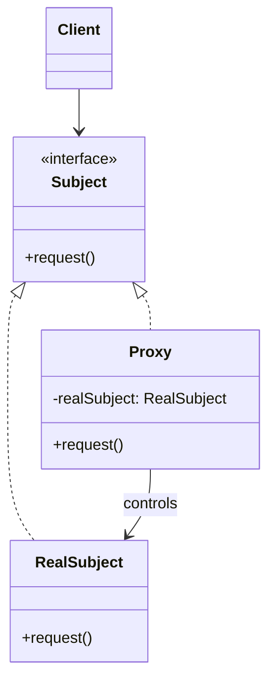
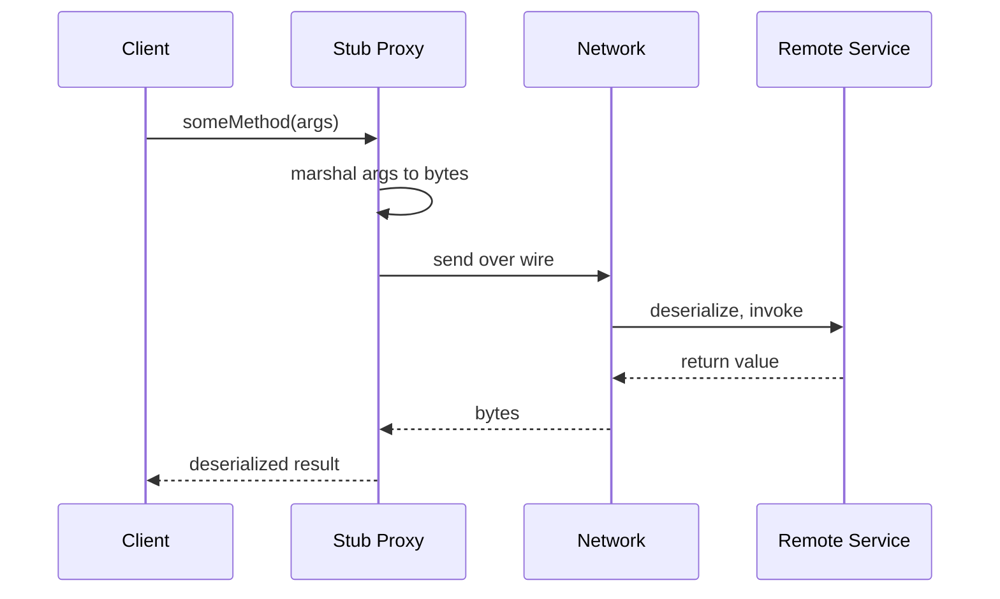

## Intent

> Wrap an object with a proxy that has the same interface, intercepting calls to add control: lazy loading, access checks, caching, remote calls, logging.

Use when:
- The real object is expensive to create — defer it.
- The real object lives elsewhere — represent it locally.
- Calls need to be guarded — check permissions, count usages, log audits.

---

## Proxy Variants

| **Variant** | **Purpose** |
|------------|-------------|
| **Virtual proxy** | Lazy-load expensive objects |
| **Remote proxy** | Represent an object in another process or machine |
| **Protection proxy** | Enforce access control |
| **Smart proxy** | Add reference counting, locking, or logging |
| **Caching proxy** | Cache results to avoid repeating expensive ops |

---

## Structure



---

## Example 1: Virtual Proxy (Lazy Loading)

```java
public interface Image {
    void display();
}

public class HighResImage implements Image {
    private final String filename;
    private byte[] data;

    public HighResImage(String filename) {
        this.filename = filename;
        loadFromDisk();   // expensive, ~500ms
    }

    private void loadFromDisk() { /* read file */ }

    public void display() { System.out.println("Rendering " + filename); }
}

public class LazyImageProxy implements Image {
    private final String filename;
    private HighResImage real;

    public LazyImageProxy(String filename) {
        this.filename = filename;
    }

    @Override
    public void display() {
        if (real == null) {
            real = new HighResImage(filename);   // load on first use
        }
        real.display();
    }
}

// Usage
Image img = new LazyImageProxy("photo.raw");   // instant
// ... do other work ...
img.display();   // loads only when actually shown
```

---

## Example 2: Protection Proxy

```java
public interface DocumentService {
    Document read(String id);
    void write(String id, Document doc);
    void delete(String id);
}

public class AuthorizingDocumentProxy implements DocumentService {
    private final DocumentService real;
    private final User user;

    public AuthorizingDocumentProxy(DocumentService real, User user) {
        this.real = real;
        this.user = user;
    }

    public Document read(String id) {
        if (!user.canRead(id)) throw new AccessDeniedException();
        return real.read(id);
    }

    public void write(String id, Document doc) {
        if (!user.canWrite(id)) throw new AccessDeniedException();
        real.write(id, doc);
    }

    public void delete(String id) {
        if (!user.isAdmin()) throw new AccessDeniedException();
        real.delete(id);
    }
}
```

The real `DocumentService` doesn't know about authorization — it's enforced in the proxy layer.

---

## Example 3: Caching Proxy

```java
public class CachingUserService implements UserService {
    private final UserService real;
    private final Cache<String, User> cache = new Cache<>();

    public User findById(String id) {
        return cache.computeIfAbsent(id, () -> real.findById(id));
    }
}
```

---

## Proxy vs Decorator vs Adapter

The structural code looks identical — the difference is *why*:

| **Pattern** | **Intent** |
|------------|-----------|
| **Proxy** | Control access to the real object |
| **Decorator** | Add new behavior to the real object |
| **Adapter** | Translate between incompatible interfaces |

A logging *decorator* adds logging as a feature. A logging *proxy* logs to enforce auditing. Same code, different naming based on the team's purpose.

---

## Remote Proxy (RPC)



The client thinks it's calling a local object. The proxy hides the network.

---

## Real-world Examples

| **Use case** | **Type** |
|-------------|----------|
| Hibernate lazy-loaded entities | Virtual proxy |
| Spring `@Transactional`, `@Async` | Smart proxy (CGLIB / JDK dynamic proxy) |
| Java RMI stubs | Remote proxy |
| `java.lang.reflect.Proxy` | Dynamic proxy framework |
| Mock objects in tests | Protection / behavioral proxy |
| CDN caching layer | Caching proxy |

---

## JDK Dynamic Proxy

Java provides built-in support for proxying interfaces at runtime:

```java
InvocationHandler handler = (proxy, method, args) -> {
    System.out.println("Calling " + method.getName());
    return method.invoke(realObject, args);
};

DocumentService proxied = (DocumentService) Proxy.newProxyInstance(
    DocumentService.class.getClassLoader(),
    new Class<?>[] { DocumentService.class },
    handler
);
```

This is how Spring AOP wires `@Transactional` without you writing proxy classes by hand.

---

## Trade-offs

✅ **Pros:**
- Cross-cutting concerns (auth, caching, logging) without touching the real class
- Lazy initialization for expensive objects
- Enables remote / distributed objects to look local

❌ **Cons:**
- Indirection — debugging gets harder
- Latency may differ between proxy and real object (callers may not realize)
- Easy to confuse with decorator / adapter at a glance

---

## Interview Tips

- When the interviewer mentions **"only certain users can"**, **"don't load until needed"**, or **"cache the response"** — proxy is a strong fit.
- Mention dynamic proxies (`java.lang.reflect.Proxy`, CGLIB) when asked about Spring AOP internals.
- Distinguish from decorator: proxy *controls access* to the real object, decorator *enhances* it.
