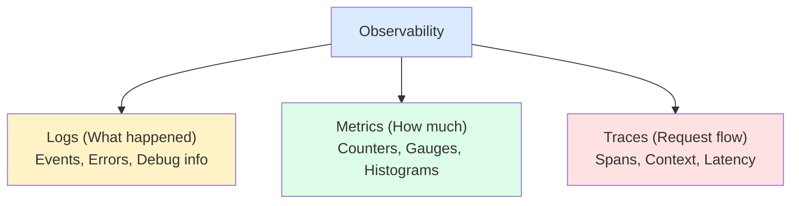

## Overview

Observability is the ability to understand a system's internal state from its external outputs. The three pillars of observability are metrics, logs, and traces.

---

## Topics

import { Cards, Card } from "fumadocs-ui/components/card";

<Cards>
  <Card
    title="Logging"
    description="Structured logging and log aggregation"
    href="/sd/observability/logging"
  />
  <Card
    title="Monitoring & Metrics"
    description="System metrics and alerting"
    href="/sd/observability/monitoring"
  />
  <Card
    title="Distributed Tracing"
    description="Request tracing across services"
    href="/sd/observability/tracing"
  />
</Cards>

---

## The Three Pillars

---

## Why Observability Matters

| **Benefit** | **Description** |
|------------|-----------------|
| Debugging | Find root cause of issues |
| Performance | Identify bottlenecks |
| Reliability | Detect and alert on failures |
| Capacity | Plan for growth |
| Business | Track KPIs and SLOs |
