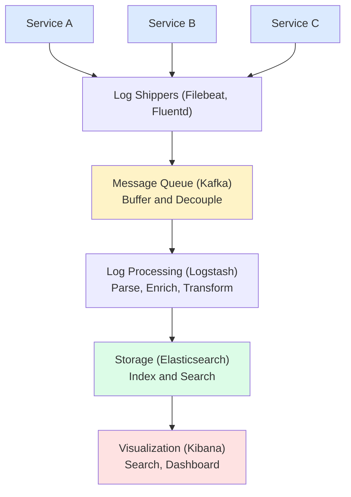
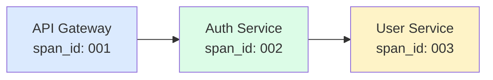

## What is Logging?

**Logging** records discrete events that occur in your system. Logs provide detailed context for debugging and auditing.

---

## Log Levels

| **Level** | **Use Case** | **Production** |
|----------|-------------|----------------|
| TRACE | Very detailed debugging | Off |
| DEBUG | Development debugging | Off |
| INFO | Normal operations | On |
| WARN | Potential issues | On |
| ERROR | Failures requiring attention | On |
| FATAL | System-critical failures | On |

---

## Structured Logging

```json
// ❌ Unstructured
"User 123 failed to login from 192.168.1.1"

// ✅ Structured (JSON)
{
  "timestamp": "2024-01-15T10:30:00.000Z",
  "level": "WARN",
  "service": "auth-service",
  "message": "Login failed",
  "user_id": "123",
  "ip": "192.168.1.1",
  "reason": "invalid_password",
  "attempt": 3,
  "trace_id": "abc123"
}
```

### Benefits of Structured Logging

| **Benefit** | **Description** |
|------------|-----------------|
| Searchable | Query by any field |
| Parseable | Machine-readable |
| Consistent | Standard format |
| Correlatable | Link with trace_id |

---

## Log Aggregation Architecture



---

## ELK Stack

```
E - Elasticsearch (Storage & Search)
L - Logstash (Processing)
K - Kibana (Visualization)

Alternative: EFK Stack
F - Fluentd (instead of Logstash)
```

---

## Log Correlation

Request flow with trace_id: abc123



All logs include trace_id for correlation:

```json
{"trace_id": "abc123", "service": "api-gateway"}
{"trace_id": "abc123", "service": "auth-service"}
{"trace_id": "abc123", "service": "user-service"}
```

Query: `trace_id = "abc123"` returns all related logs.

---

## Log Retention

```
Hot Storage (SSD):
├── Last 7 days
├── Fast queries
└── Expensive

Warm Storage (HDD):
├── 7-30 days
├── Slower queries
└── Moderate cost

Cold Storage (S3/Glacier):
├── 30+ days
├── Compliance/Audit
└── Cheap, slow access

Index Lifecycle Management (ILM):
Day 0  → Hot
Day 7  → Warm (force merge)
Day 30 → Cold (read-only)
Day 90 → Delete
```

---

## Sensitive Data Handling

```javascript
// ❌ Bad: Logging sensitive data
logger.info(`User ${email} logged in with password ${password}`);

// ❌ Bad: Logging PII
logger.info(`Credit card: ${cardNumber}`);

// ✅ Good: Mask sensitive data
logger.info(`User ${maskEmail(email)} logged in`);
// Output: User j***@example.com logged in

// ✅ Good: Log only necessary info
logger.info({
  event: 'login',
  user_id: userId,
  success: true
});
```

---

## Sampling Strategies

```
High Volume Systems:

1. Sample Rate
   Log 1 in 100 requests (1%)

2. Head-based Sampling
   Decide at start of request

3. Tail-based Sampling
   Log all errors, sample successes

4. Adaptive Sampling
   Adjust based on traffic volume

Example:
if (isError || random() < 0.01) {
  logger.info(requestDetails);
}
```

---

## Best Practices

| **Practice** | **Description** |
|-------------|-----------------|
| Use structured logs | JSON format |
| Include context | trace_id, user_id, request_id |
| Appropriate levels | Don't log DEBUG in prod |
| Don't log secrets | Mask PII, passwords |
| Centralize logs | Aggregate from all services |
| Set retention | Balance cost vs compliance |

---

## Interview Tips

- Explain structured vs unstructured logging
- Know ELK/EFK stack components
- Discuss log correlation with trace IDs
- Cover log retention strategies
- Mention sampling for high-volume systems
