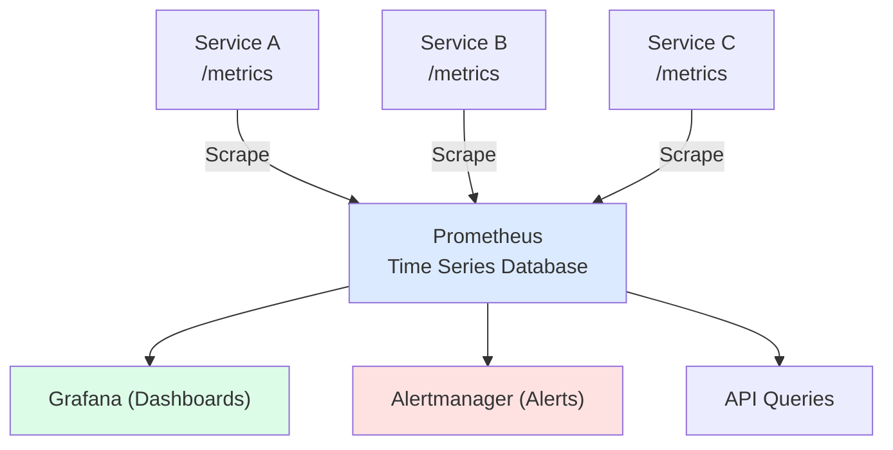
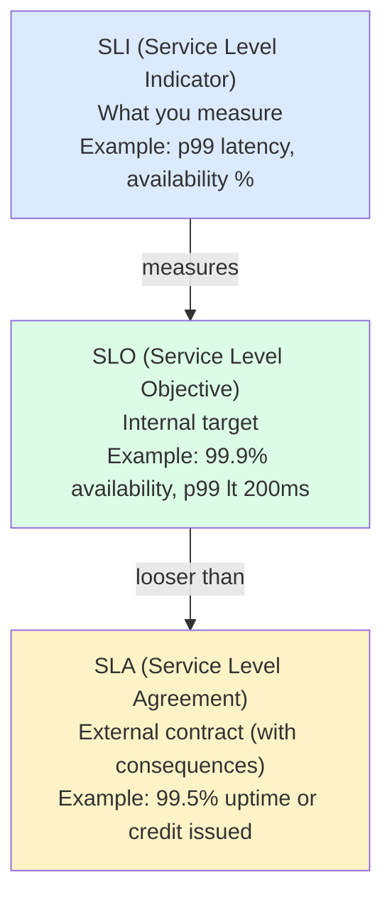

## What is Monitoring?

**Monitoring** is the collection, aggregation, and analysis of metrics to understand system health and performance.

---

## Metric Types

| **Type** | **Description** | **Example** |
|---------|-----------------|-------------|
| Counter | Cumulative value (only increases) | Total requests |
| Gauge | Point-in-time value | CPU usage, queue size |
| Histogram | Distribution of values | Request latency |
| Summary | Similar to histogram with quantiles | Response times |

---

## The Four Golden Signals

```
Google SRE's Four Golden Signals:

┌──────────────┬──────────────┬──────────────┬──────────────┐
│   Latency    │   Traffic    │    Errors    │  Saturation  │
├──────────────┼──────────────┼──────────────┼──────────────┤
│ How long     │ How much     │ Rate of      │ How "full"   │
│ requests     │ demand on    │ failed       │ is the       │
│ take         │ the system   │ requests     │ service      │
├──────────────┼──────────────┼──────────────┼──────────────┤
│ p50, p95,    │ Requests     │ 5xx rate,    │ CPU, Memory, │
│ p99 latency  │ per second   │ Error %      │ Queue depth  │
└──────────────┴──────────────┴──────────────┴──────────────┘
```

---

## RED Method (Request-Centric)

```
For request-driven services:

R - Rate     (requests per second)
E - Errors   (failed requests per second)
D - Duration (latency distribution)
```

---

## USE Method (Resource-Centric)

```
For resources (CPU, memory, disk):

U - Utilization (% time resource is busy)
S - Saturation  (degree of queueing)
E - Errors      (error count)

Example for CPU:
┌───────────────────────────────────────────────┐
│ CPU Analysis                                  │
├────────────────┬──────────────────────────────┤
│ Utilization    │ 85% average                  │
│ Saturation     │ 12 processes in run queue    │
│ Errors         │ 0 hardware errors            │
└────────────────┴──────────────────────────────┘
```

---

## Monitoring Architecture



---

## SLIs, SLOs, and SLAs



### Error Budget

```
SLO: 99.9% availability

Error Budget = 100% - 99.9% = 0.1%

Per month (30 days):
0.1% × 30 days × 24 hours × 60 min = 43.2 minutes

Budget Consumption:
┌────────────────────────────────────────┐
│ ████████████░░░░░░░░░░░░░░░░░░░░░░░░░░│ 35%
└────────────────────────────────────────┘
Used: 15 min | Remaining: 28 min
```

---

## Alerting

### Alert Configuration

```yaml
# Prometheus Alert Rule
groups:
  - name: api-alerts
    rules:
      - alert: HighErrorRate
        expr: |
          sum(rate(http_requests_total{status=~"5.."}[5m])) /
          sum(rate(http_requests_total[5m])) > 0.01
        for: 5m
        labels:
          severity: critical
        annotations:
          summary: "High error rate detected"
          description: "Error rate is {{ $value | humanizePercentage }}"
```

### Alert Severity

| **Severity** | **Response** | **Example** |
|-------------|-------------|-------------|
| Critical | Page on-call immediately | Service down |
| Warning | Slack/email notification | High latency |
| Info | Dashboard only | Deploy completed |

### Alert Fatigue Prevention

```
❌ Bad: Too many alerts
- Every 1% CPU spike
- Every single error
- Duplicate alerts

✅ Good: Actionable alerts
- Symptom-based (user impact)
- Properly tuned thresholds
- Grouped/deduplicated
- Clear runbook link
```

---

## Dashboards

```
┌─────────────────────────────────────────────────────────┐
│                  Service Overview                        │
├─────────────────┬─────────────────┬─────────────────────┤
│    Requests     │    Latency      │    Error Rate       │
│   ┌─────────┐   │   ┌─────────┐   │   ┌─────────┐       │
│   │ 12.5k/s │   │   │ p99:45ms│   │   │  0.02%  │       │
│   └─────────┘   │   └─────────┘   │   └─────────┘       │
├─────────────────┴─────────────────┴─────────────────────┤
│               Request Rate (last 24h)                    │
│   ▁▂▃▄▅▆▇█▇▆▅▄▃▂▁▁▂▃▄▅▆▇█▇▆▅▄▃▂                        │
├─────────────────────────────────────────────────────────┤
│               Latency Distribution                       │
│   p50: ████████░░░░░░░░ 12ms                            │
│   p95: ████████████░░░░ 28ms                            │
│   p99: ██████████████░░ 45ms                            │
└─────────────────────────────────────────────────────────┘
```

---

## Infrastructure Metrics

```
Server Metrics:
├── CPU (usage, iowait, steal)
├── Memory (used, cached, available)
├── Disk (usage, IOPS, latency)
├── Network (bytes in/out, errors)
└── Processes (count, states)

Container Metrics:
├── CPU limit/usage
├── Memory limit/usage
├── Restarts
└── Network I/O

Application Metrics:
├── Request rate
├── Error rate
├── Latency percentiles
├── Active connections
└── Queue depth
```

---

## Tools

| **Category** | **Tools** |
|-------------|-----------|
| Time Series DB | Prometheus, InfluxDB, TimescaleDB |
| Visualization | Grafana, Datadog, New Relic |
| Alerting | Alertmanager, PagerDuty, OpsGenie |
| APM | Datadog, New Relic, Dynatrace |

---

## Interview Tips

- Know the Four Golden Signals
- Explain SLI/SLO/SLA relationship
- Discuss error budget concept
- Cover alerting best practices
- Mention RED and USE methods
