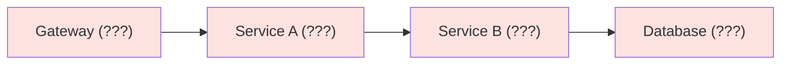
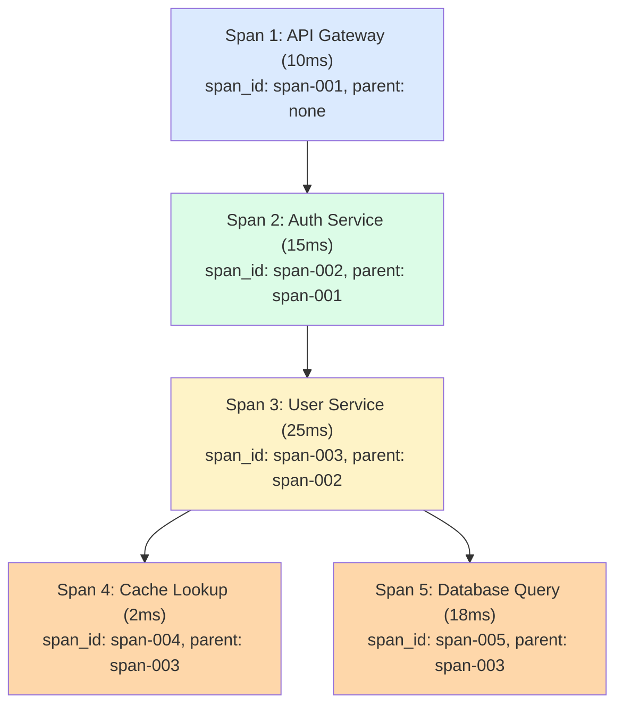
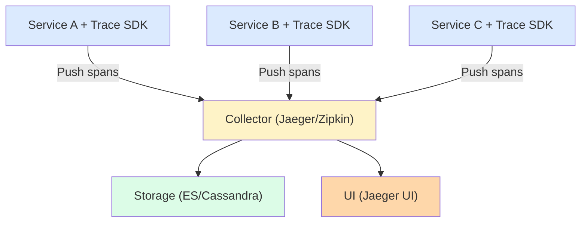
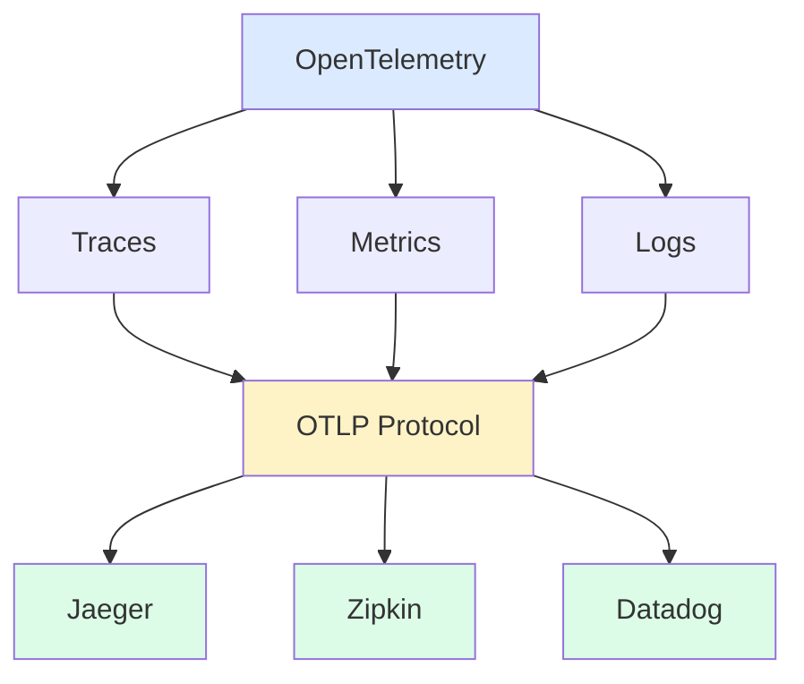

## What is Distributed Tracing?

**Distributed Tracing** tracks requests as they flow through multiple services, providing visibility into the complete request lifecycle.

---

## Why Distributed Tracing?

Without tracing, a user reports a slow request but you cannot tell which service caused it.



With tracing: Total 250ms = Gateway(10ms) + A(20ms) + B(200ms, bottleneck) + DB(20ms).

---

## Key Concepts

| **Concept** | **Description** |
|------------|-----------------|
| Trace | Complete journey of a request |
| Span | Single unit of work within a trace |
| Trace ID | Unique identifier for entire request |
| Span ID | Unique identifier for a span |
| Parent Span | Span that initiated current span |

---

## Trace Structure

Trace ID: abc123



Timeline:

```
|--Gateway--|
            |---Auth---|
                       |--------User--------|
                       |-Cache-|  |---DB---|
0ms        10ms       25ms     27ms       50ms
```

---

## Context Propagation

```
HTTP Headers for Context:

Request from Service A to Service B:
┌─────────────────────────────────────────────┐
│ GET /api/users HTTP/1.1                     │
│ Host: service-b.internal                    │
│ traceparent: 00-abc123-span001-01           │
│ tracestate: vendor=value                    │
└─────────────────────────────────────────────┘

W3C Trace Context Format:
traceparent: {version}-{trace-id}-{parent-span-id}-{flags}
             00        -abc123   -span001        -01

Common Headers:
- traceparent (W3C standard)
- X-B3-TraceId (Zipkin B3)
- uber-trace-id (Jaeger)
```

---

## Span Data

```json
{
  "traceId": "abc123def456",
  "spanId": "span-003",
  "parentSpanId": "span-002",
  "operationName": "GET /users/:id",
  "serviceName": "user-service",
  "startTime": "2024-01-15T10:30:00.000Z",
  "duration": 25,
  "tags": {
    "http.method": "GET",
    "http.status_code": 200,
    "http.url": "/users/123",
    "user.id": "123"
  },
  "logs": [
    {
      "timestamp": "2024-01-15T10:30:00.002Z",
      "message": "Cache miss"
    }
  ]
}
```

---

## Tracing Architecture



---

## OpenTelemetry



### Instrumentation

```javascript
// OpenTelemetry JavaScript Example
const { trace } = require('@opentelemetry/api');

const tracer = trace.getTracer('my-service');

async function handleRequest(req) {
  // Create a span
  return tracer.startActiveSpan('handle-request', async (span) => {
    try {
      span.setAttribute('http.method', req.method);
      span.setAttribute('http.url', req.url);

      const result = await processRequest(req);

      span.setStatus({ code: SpanStatusCode.OK });
      return result;
    } catch (error) {
      span.setStatus({
        code: SpanStatusCode.ERROR,
        message: error.message
      });
      span.recordException(error);
      throw error;
    } finally {
      span.end();
    }
  });
}
```

---

## Sampling Strategies

```
High-traffic systems can't trace every request:

1. Head-based Sampling
   Decide at trace start (e.g., 1% of requests)
   ✓ Simple
   ✗ May miss interesting traces

2. Tail-based Sampling
   Decide after trace complete
   ✓ Keep all errors and slow traces
   ✗ Higher resource usage

3. Rate-limited Sampling
   N traces per second

4. Priority Sampling
   Always trace: errors, slow requests, specific users
   Sample: normal requests

Configuration:
{
  "sampler": {
    "type": "probabilistic",
    "param": 0.01,  // 1% sampling
    "always_sample_errors": true,
    "always_sample_slow": {
      "threshold_ms": 1000
    }
  }
}
```

---

## Tracing Tools

| **Tool** | **Type** | **Features** |
|---------|---------|-------------|
| Jaeger | Open source | Uber-developed, Kubernetes native |
| Zipkin | Open source | Twitter-developed, simple |
| Datadog APM | Commercial | Full observability platform |
| AWS X-Ray | Cloud | AWS-native tracing |
| Honeycomb | Commercial | High cardinality analysis |

---

## Best Practices

| **Practice** | **Description** |
|-------------|-----------------|
| Trace all services | 100% of services instrumented |
| Consistent naming | Same operation names across services |
| Add context | User ID, request ID, feature flags |
| Sample wisely | 100% errors, sample successes |
| Set timeouts | Don't block on tracing |

---

## Interview Tips

- Explain trace, span, and context propagation
- Know W3C trace context format
- Discuss sampling strategies
- Mention OpenTelemetry as the standard
- Cover when tracing helps vs logs/metrics
