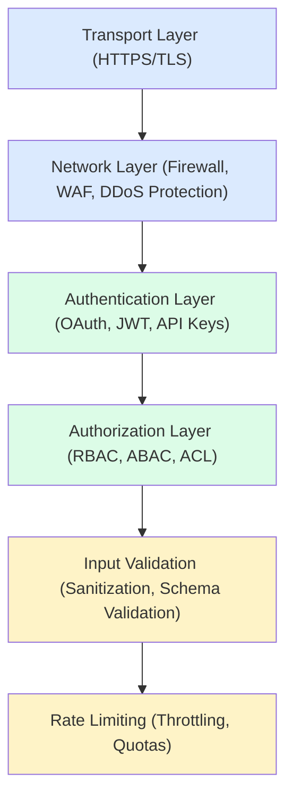
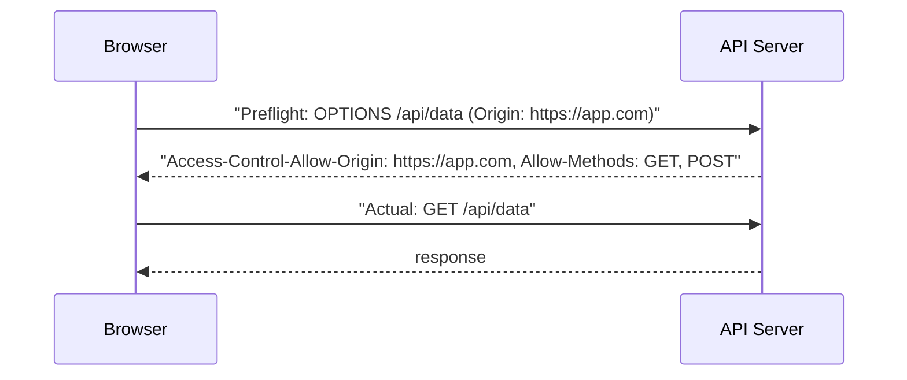
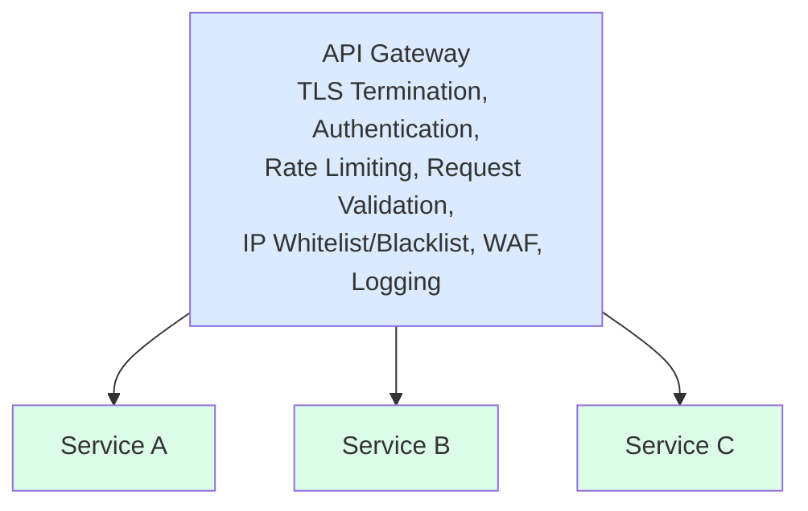
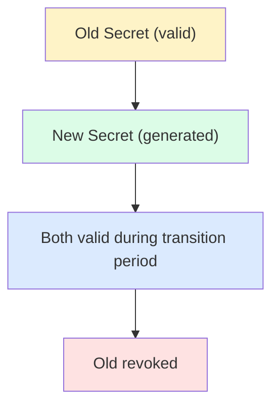

## Why API Security Matters

APIs are the primary attack surface for modern applications. Proper security prevents data breaches, unauthorized access, and service abuse.

---

## API Security Layers



---

## Authentication Methods

| **Method** | **Security** | **Use Case** |
|-----------|-------------|--------------|
| API Keys | Low | Public APIs, internal services |
| JWT | Medium | Stateless authentication |
| OAuth 2.0 | High | Third-party access |
| mTLS | Very High | Service-to-service |

### API Key Best Practices

```
❌ Bad: API key in URL
GET /api/data?api_key=abc123

✅ Good: API key in header
GET /api/data
X-API-Key: abc123

Best Practices:
- Rotate keys regularly
- Use different keys per environment
- Hash keys in storage (show only once)
- Implement key scoping (read-only, etc.)
```

---

## Rate Limiting

### Strategies

| **Strategy** | **Description** |
|-------------|-----------------|
| Fixed Window | N requests per time window |
| Sliding Window | Rolling time window |
| Token Bucket | Burst-friendly limiting |
| Leaky Bucket | Smooth output rate |

### Implementation

```
┌───────────────────────────────────────────────┐
│              Rate Limit Headers                │
├───────────────────────────────────────────────┤
│ X-RateLimit-Limit: 1000                       │
│ X-RateLimit-Remaining: 999                    │
│ X-RateLimit-Reset: 1640000000                 │
│ Retry-After: 60                               │
└───────────────────────────────────────────────┘

Response when exceeded:
HTTP/1.1 429 Too Many Requests
{
  "error": "Rate limit exceeded",
  "retry_after": 60
}
```

### Multi-Tier Limits

```
Per User:    100 requests/minute
Per IP:      1000 requests/minute
Per API Key: 10000 requests/hour
Global:      1M requests/minute
```

---

## Input Validation

### Common Attacks

| **Attack** | **Prevention** |
|-----------|---------------|
| SQL Injection | Parameterized queries |
| XSS | Output encoding |
| Command Injection | Input sanitization |
| Path Traversal | Whitelist paths |

### Schema Validation

```javascript
// OpenAPI/JSON Schema validation
const schema = {
  type: 'object',
  required: ['email', 'name'],
  properties: {
    email: {
      type: 'string',
      format: 'email',
      maxLength: 255
    },
    name: {
      type: 'string',
      minLength: 1,
      maxLength: 100,
      pattern: '^[a-zA-Z ]+$'
    },
    age: {
      type: 'integer',
      minimum: 0,
      maximum: 150
    }
  },
  additionalProperties: false
};

// Validate all inputs against schema
```

---

## CORS (Cross-Origin Resource Sharing)



Configuration:
- Good: Specific origins (https://app.com)
- Bad: Wildcard in production (*)

---

## Request Signing

```
Signed Request (AWS Signature v4 style):

1. Create canonical request
   CanonicalRequest =
     HTTPMethod + '\n' +
     URI + '\n' +
     QueryString + '\n' +
     Headers + '\n' +
     SignedHeaders + '\n' +
     Hash(Payload)

2. Create string to sign
   StringToSign =
     Algorithm + '\n' +
     Timestamp + '\n' +
     Scope + '\n' +
     Hash(CanonicalRequest)

3. Calculate signature
   Signature = HMAC-SHA256(SigningKey, StringToSign)

4. Add to request
   Authorization: AWS4-HMAC-SHA256
     Credential=.../Signature=abc123
```

---

## Security Headers

```http
# Prevent clickjacking
X-Frame-Options: DENY

# Prevent MIME sniffing
X-Content-Type-Options: nosniff

# Enable XSS filter
X-XSS-Protection: 1; mode=block

# Content Security Policy
Content-Security-Policy: default-src 'self'

# Strict Transport Security
Strict-Transport-Security: max-age=31536000; includeSubDomains

# Don't send referrer
Referrer-Policy: no-referrer
```

---

## API Gateway Security



---

## Secrets Management

```
❌ Bad: Secrets in code
const API_KEY = "sk_live_abc123";

❌ Bad: Secrets in git
.env committed to repository

✅ Good: Environment variables
const API_KEY = process.env.API_KEY;

✅ Better: Secrets manager
const secret = await secretsManager.get('api-key');

```

### Secret Rotation



---

## Audit Logging

```json
{
  "timestamp": "2024-01-15T10:30:00Z",
  "request_id": "req_abc123",
  "user_id": "user_456",
  "ip": "192.168.1.100",
  "method": "DELETE",
  "path": "/api/users/789",
  "status": 200,
  "user_agent": "Mozilla/5.0...",
  "duration_ms": 45,
  "geo": {
    "country": "US",
    "city": "San Francisco"
  }
}

Log:
✓ Authentication attempts (success/failure)
✓ Authorization decisions
✓ Data access/modifications
✓ Admin actions
✗ Sensitive data (passwords, tokens)
```

---

## Interview Tips

- Cover defense in depth (multiple layers)
- Know rate limiting algorithms
- Explain input validation importance
- Discuss secrets management
- Mention API gateway benefits
- Cover audit logging requirements
