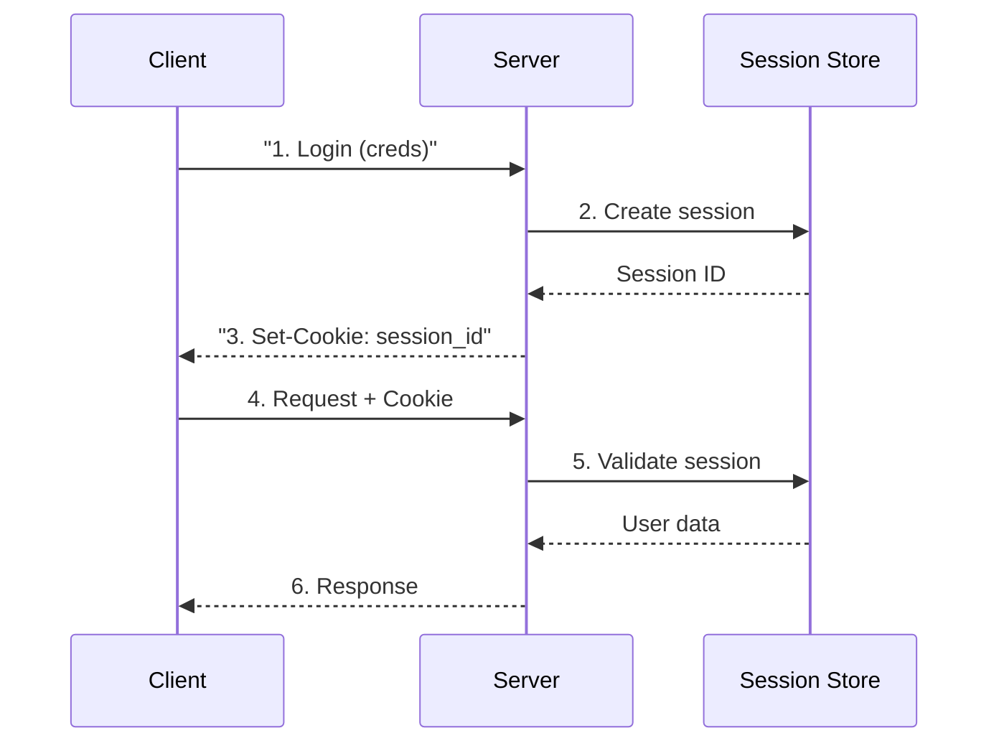
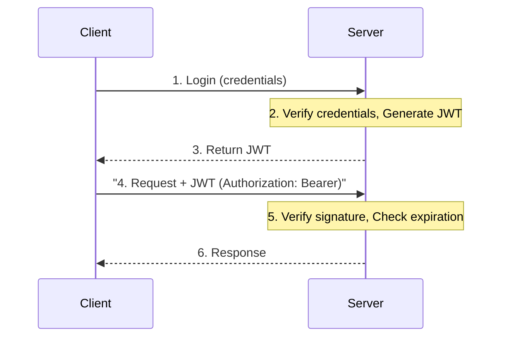
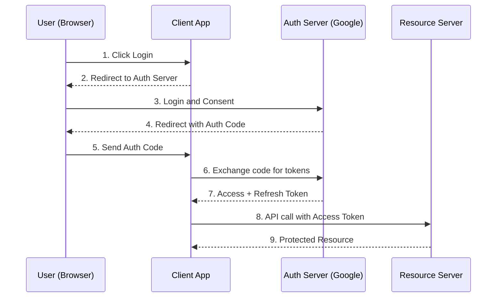
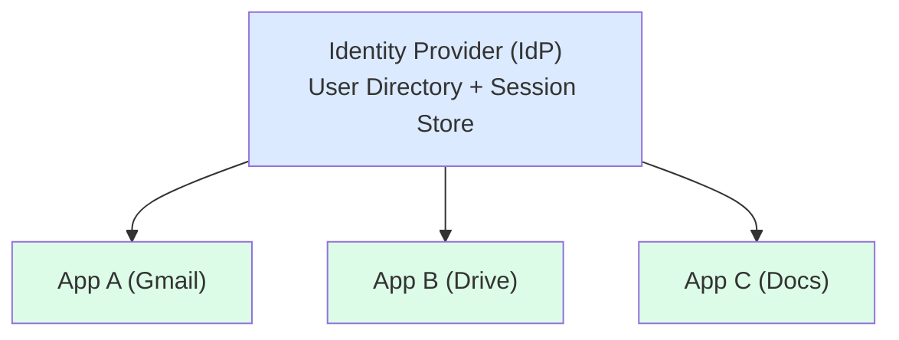
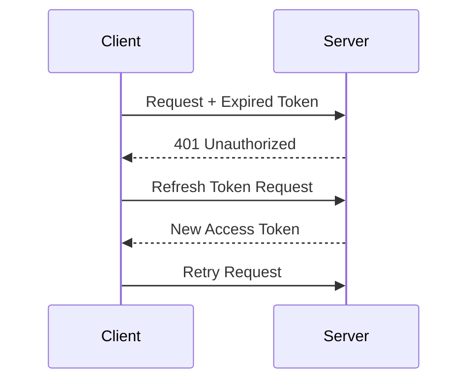

## What is Authentication?

**Authentication** is the process of verifying the identity of a user or system. It answers the question: "Who are you?"

---

## Authentication Methods

| **Method** | **Description** | **Use Case** |
|-----------|-----------------|--------------|
| Password | Traditional username/password | Web applications |
| MFA | Multiple verification factors | High-security apps |
| OAuth | Delegated authorization | Third-party login |
| SSO | Single Sign-On | Enterprise systems |
| API Keys | Static tokens | Service-to-service |
| JWT | JSON Web Tokens | Stateless auth |
| Certificates | X.509 certificates | mTLS, IoT |

---

## Session-Based Authentication



**Pros**: Easy revocation, server control
**Cons**: Stateful, session storage scaling

---

## JWT (JSON Web Tokens)

### Structure

```
Header.Payload.Signature

eyJhbGciOiJIUzI1NiJ9.eyJzdWIiOiJ1c2VyMTIzIn0.signature

┌─────────────────────────────────────────────────────┐
│                     Header                          │
│  { "alg": "HS256", "typ": "JWT" }                  │
├─────────────────────────────────────────────────────┤
│                     Payload                         │
│  {                                                  │
│    "sub": "user123",                               │
│    "name": "John Doe",                             │
│    "iat": 1516239022,                              │
│    "exp": 1516242622                               │
│  }                                                  │
├─────────────────────────────────────────────────────┤
│                    Signature                        │
│  HMACSHA256(                                        │
│    base64(header) + "." + base64(payload),         │
│    secret                                           │
│  )                                                  │
└─────────────────────────────────────────────────────┘
```

### JWT Flow



**Pros**: Stateless, scalable, self-contained
**Cons**: Can't revoke easily, size overhead

---

## OAuth 2.0

### OAuth Roles

| **Role** | **Description** |
|---------|-----------------|
| Resource Owner | User who owns the data |
| Client | Application requesting access |
| Authorization Server | Issues access tokens |
| Resource Server | Hosts protected resources |

### Authorization Code Flow



---

## Single Sign-On (SSO)



Login once and access all applications.

### SSO Protocols

| **Protocol** | **Use Case** |
|-------------|--------------|
| SAML 2.0 | Enterprise SSO |
| OpenID Connect | Consumer apps (built on OAuth) |
| LDAP | Internal directory |

---

## Token Refresh Flow

Access Token: Short-lived (15 min to 1 hour). Refresh Token: Long-lived (days to weeks).



---

## Session vs JWT Comparison

| **Aspect** | **Session** | **JWT** |
|-----------|-------------|---------|
| State | Stateful | Stateless |
| Storage | Server-side | Client-side |
| Scalability | Needs shared store | Easy horizontal scale |
| Revocation | Immediate | Difficult (need blocklist) |
| Size | Small cookie | Larger token |
| Security | Server controlled | Self-contained |

---

## Best Practices

| **Practice** | **Description** |
|-------------|-----------------|
| HTTPS only | Encrypt all auth traffic |
| Secure cookies | HttpOnly, Secure, SameSite |
| Short token life | Minimize exposure window |
| Refresh rotation | Rotate refresh tokens |
| Rate limiting | Prevent brute force |
| MFA | Add second factor for sensitive ops |

---

## Interview Tips

- Know OAuth 2.0 authorization code flow
- Explain JWT structure and validation
- Discuss session vs token trade-offs
- Mention token refresh patterns
- Cover SSO for enterprise systems
