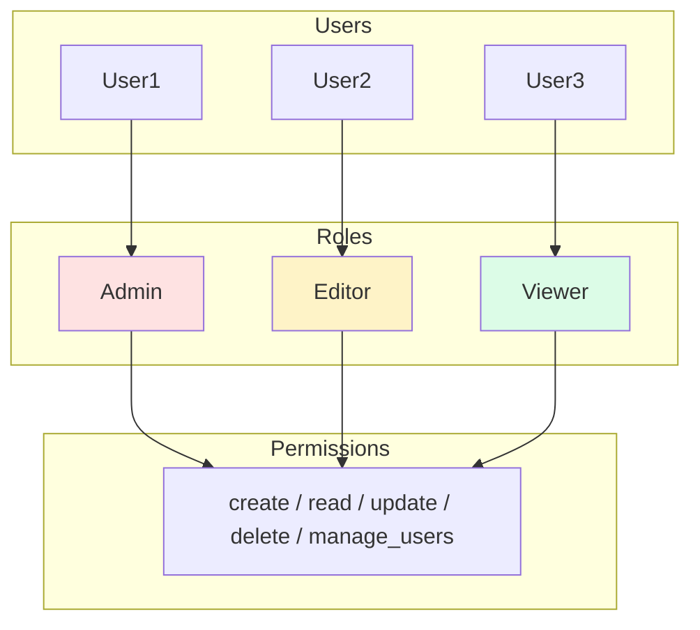
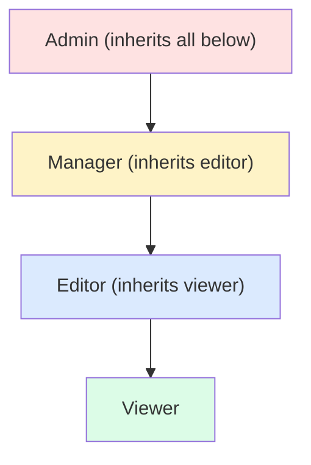
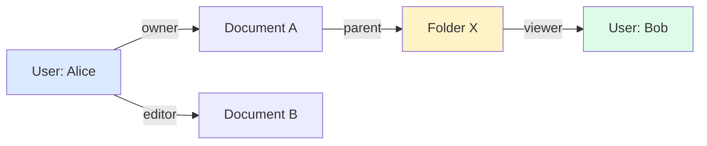
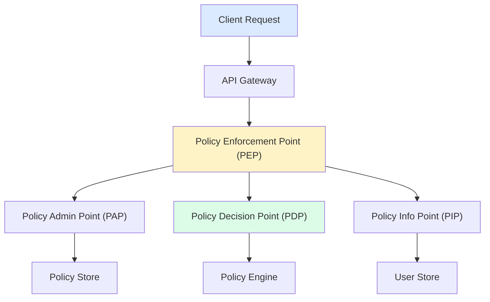

## What is Authorization?

**Authorization** determines what actions an authenticated user can perform. It answers: "What are you allowed to do?"

---

## Authorization Models

| **Model** | **Description** | **Best For** |
|----------|-----------------|--------------|
| RBAC | Role-Based Access Control | Most applications |
| ABAC | Attribute-Based Access Control | Complex policies |
| ACL | Access Control Lists | File systems |
| ReBAC | Relationship-Based Access Control | Social apps |

---

## RBAC (Role-Based Access Control)

### Structure



### Example

```javascript
const roles = {
  admin: ['create', 'read', 'update', 'delete', 'manage_users'],
  editor: ['create', 'read', 'update'],
  viewer: ['read']
};

const userRoles = {
  'user1': ['admin'],
  'user2': ['editor'],
  'user3': ['viewer']
};

function hasPermission(userId, permission) {
  const roles = userRoles[userId] || [];
  return roles.some(role =>
    roles[role]?.includes(permission)
  );
}

// Check
hasPermission('user1', 'delete');      // true
hasPermission('user3', 'delete');      // false
```

### Hierarchical RBAC



---

## ABAC (Attribute-Based Access Control)

### Policy Components

```
Subject Attributes:    user.role, user.department, user.clearance
Resource Attributes:   document.classification, document.owner
Action:               read, write, delete
Environment:          time, location, device_type

Policy Example:
IF user.department == document.department
   AND user.clearance >= document.classification
   AND time.hour BETWEEN 9 AND 17
THEN ALLOW read
```

### Example

```javascript
const policy = {
  effect: 'allow',
  action: 'read',
  conditions: [
    { attribute: 'user.department', operator: 'equals', value: 'resource.department' },
    { attribute: 'user.clearance', operator: '>=', value: 'resource.classification' },
    { attribute: 'env.time', operator: 'between', value: [9, 17] }
  ]
};

function evaluate(user, resource, action, env) {
  // Check all conditions
  return policy.conditions.every(condition => {
    // Evaluate each condition...
  });
}
```

---

## ReBAC (Relationship-Based Access Control)

Used for social networks and collaborative apps:



Query: Can Bob view Document A? Path: Bob is viewer of Folder X, which is parent of Document A. Result: YES (inherited from folder).

### Zanzibar (Google's AuthZ System)

```
// Relation tuples
document:doc1#owner@user:alice
document:doc1#parent@folder:folder1
folder:folder1#viewer@user:bob

// Check: Can bob view doc1?
// Traverse: doc1 → folder1 → bob (viewer)
// Result: Allowed
```

---

## ACL (Access Control Lists)

```
File: /documents/report.pdf

ACL:
┌─────────────────────────────────────┐
│ Principal     │ Permissions         │
├───────────────┼─────────────────────┤
│ alice         │ read, write, delete │
│ bob           │ read                │
│ @engineering  │ read, write         │
│ @everyone     │ (none)              │
└───────────────┴─────────────────────┘
```

---

## Policy Decision Point (PDP) Architecture



---

## Comparison

| **Aspect** | **RBAC** | **ABAC** | **ReBAC** |
|-----------|----------|----------|-----------|
| Complexity | Simple | Complex | Medium |
| Granularity | Role-level | Attribute-level | Relationship |
| Scalability | Good | Harder | Good |
| Use Case | Enterprise apps | Healthcare, Gov | Social, Collab |
| Maintenance | Role explosion risk | Policy complexity | Graph queries |

---

## Implementation Patterns

### Middleware Pattern

```javascript
// Express middleware
function authorize(requiredPermission) {
  return async (req, res, next) => {
    const user = req.user;
    const resource = req.params.resourceId;

    const allowed = await authzService.check({
      subject: user.id,
      action: requiredPermission,
      resource: resource
    });

    if (!allowed) {
      return res.status(403).json({ error: 'Forbidden' });
    }

    next();
  };
}

// Usage
app.delete('/documents/:id',
  authenticate,
  authorize('document:delete'),
  deleteDocument
);
```

---

## Interview Tips

- Know RBAC vs ABAC trade-offs
- Explain role hierarchy and inheritance
- Discuss centralized vs distributed authorization
- Mention real systems (Zanzibar, OPA)
- Cover permission caching strategies
