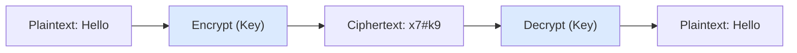
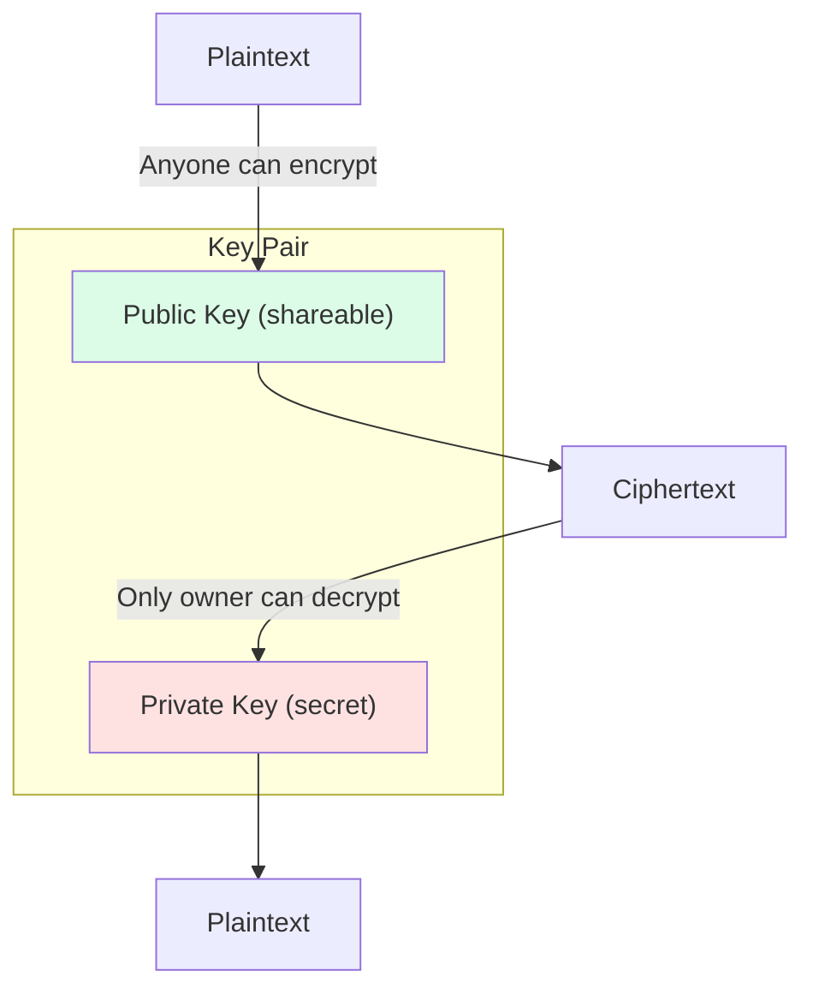
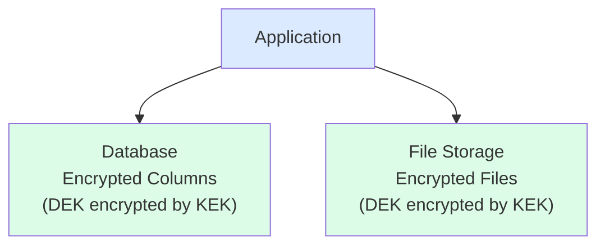
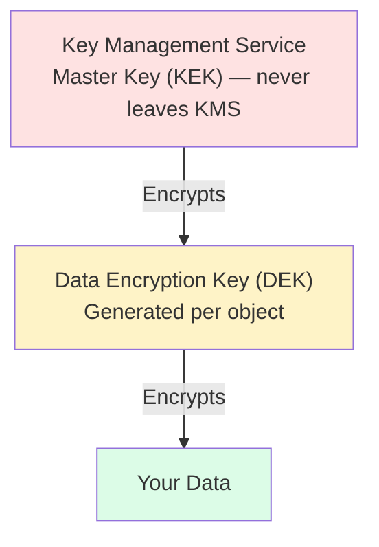
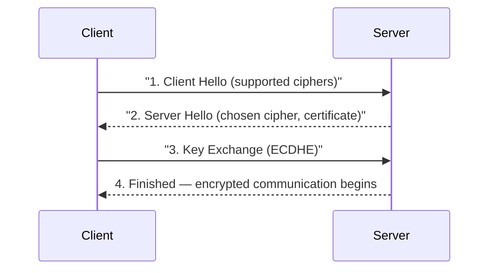
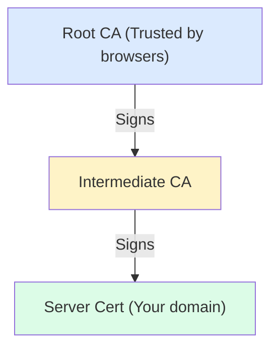
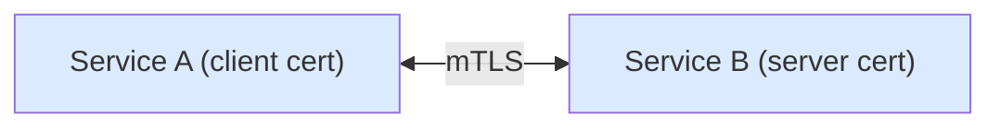
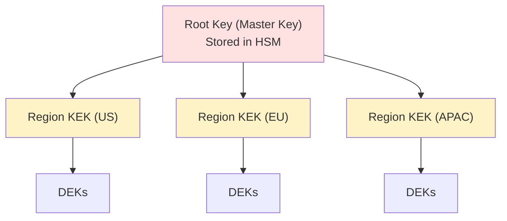

## What is Encryption?

**Encryption** transforms data into an unreadable format that can only be decoded with the correct key. It protects data confidentiality.

---

## Encryption Types

| **Type** | **Description** | **Use Case** |
|---------|-----------------|--------------|
| Symmetric | Same key for encrypt/decrypt | Data at rest, fast |
| Asymmetric | Public/private key pair | Key exchange, signatures |
| Hashing | One-way transformation | Passwords, integrity |

---

## Symmetric Encryption



Algorithms: AES-256 (recommended), ChaCha20-Poly1305.

### AES Modes

| **Mode** | **Use Case** | **Properties** |
|---------|-------------|----------------|
| GCM | General purpose | Authenticated, parallel |
| CBC | Legacy | Needs padding, sequential |
| CTR | Streaming | Parallel, no padding |

---

## Asymmetric Encryption



Algorithms: RSA-2048/4096, ECDSA (Elliptic Curve).

---

## Data at Rest



### Envelope Encryption



Storage: Encrypted Data + Encrypted DEK (by KEK).

---

## Data in Transit



### Certificate Chain



### mTLS (Mutual TLS)



Both sides verify certificates. Used for service-to-service authentication.

---

## Password Hashing

```
❌ Bad: Plain text
password = "secret123"

❌ Bad: Simple hash
hash = MD5("secret123")  // Rainbow table vulnerable

❌ Bad: Unsalted
hash = SHA256("secret123")  // Same passwords = same hash

✅ Good: Salted + slow hash
hash = bcrypt("secret123", salt, cost=12)
hash = Argon2id("secret123", salt, memory, iterations)

Storage:
┌─────────────────────────────────────────────┐
│ $argon2id$v=19$m=65536,t=3,p=4$salt$hash    │
│   │        │      │        │   │     │      │
│   │        │      │        │   │     └─ Hash│
│   │        │      │        │   └─ Salt      │
│   │        │      │        └─ Parallelism   │
│   │        │      └─ Iterations             │
│   │        └─ Memory (KB)                   │
│   └─ Algorithm                              │
└─────────────────────────────────────────────┘
```

---

## Key Management

### Key Hierarchy



### Key Rotation

```
Timeline:
├── Key v1 Active ──────────────────────┤
│                  ├── Key v2 Active ────────────────┤
│                  │                   ├── Key v1 Expired
│                  │                   │
▼                  ▼                   ▼
Create v1      Create v2           Destroy v1

During overlap:
- Encrypt with v2 (latest)
- Decrypt with v1 or v2 (either)
```

---

## Field-Level Encryption

```javascript
// Encrypt sensitive fields before storage
const user = {
  id: "user123",
  email: encrypt("user@example.com"),      // Encrypted
  name: encrypt("John Doe"),               // Encrypted
  created_at: "2024-01-15T10:00:00Z"       // Plain
};

// Searchable encryption
const emailHash = deterministicHash("user@example.com");
// Can search by hash without decrypting
```

---

## Cloud KMS Services

| **Provider** | **Service** |
|-------------|-------------|
| AWS | KMS, CloudHSM |
| GCP | Cloud KMS, Cloud HSM |
| Azure | Key Vault |
| HashiCorp | Vault |

---

## Interview Tips

- Know symmetric vs asymmetric trade-offs
- Explain envelope encryption pattern
- Discuss key rotation strategies
- Cover TLS handshake basics
- Mention password hashing best practices (Argon2, bcrypt)
- Know compliance requirements (PCI, HIPAA)
